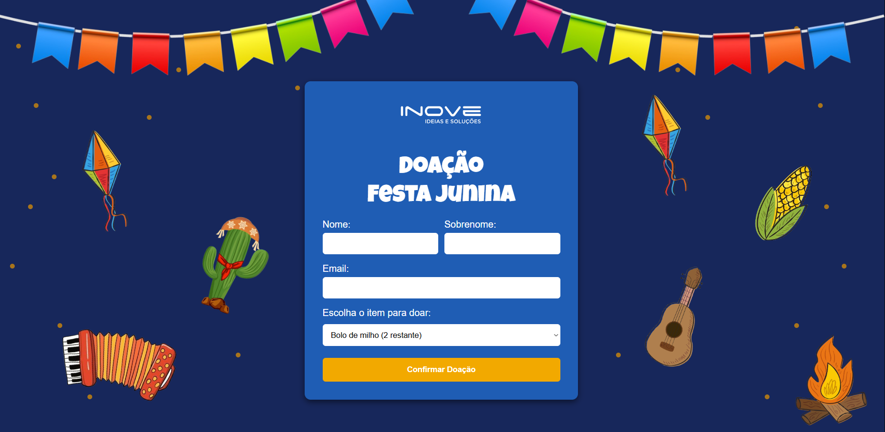
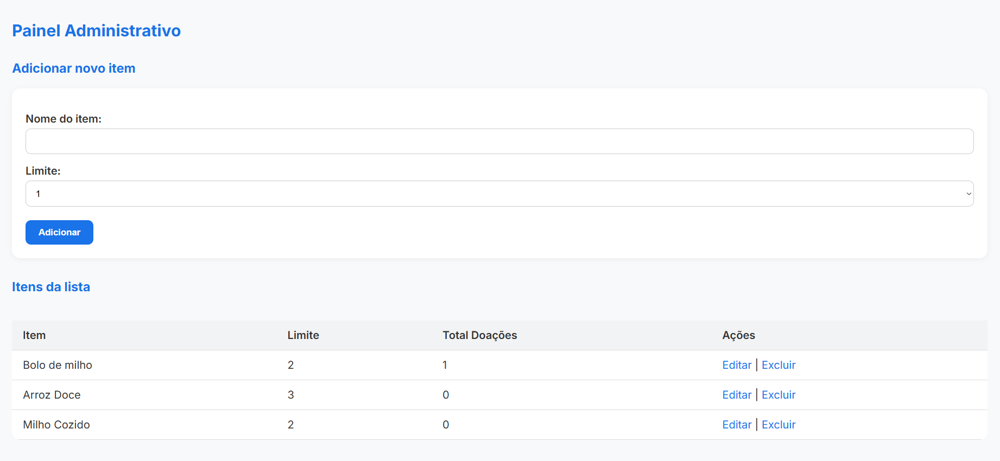
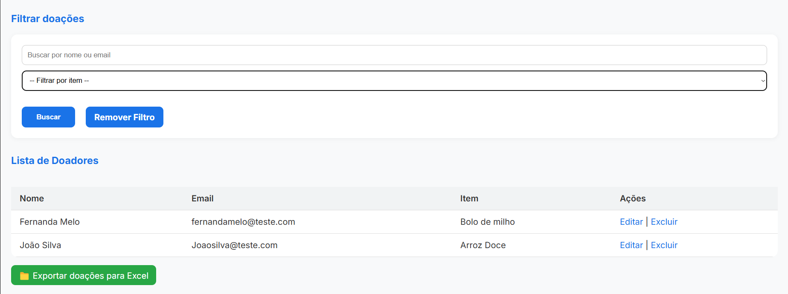

# 🎉 Sistema de Gerenciamento de Doações - Tema Festa Junina

Este é um sistema web completo desenvolvido para organizar doações de forma prática, intuitiva e eficiente. Com interface responsiva e personalizada com tema de **festa junina**, o sistema permite controlar quais itens estão disponíveis para doação, gerenciar doações recebidas, enviar e-mails automáticos de confirmação e exportar relatórios.

## 🧩 Funcionalidades

### 👥 Formulário para Doadores
- Cadastro simples com nome, sobrenome, e-mail e seleção de item para doação.
- Itens exibidos apenas enquanto estiverem disponíveis (com base em limite definido).
- Mensagem de sucesso exibida após o envio.
- Envio automático de e-mail com confirmação da doação.

### 🛠️ Painel do Administrador
- Adição de novos itens com limite personalizado de doações (ex: 1 a 10).
- Visualização de itens disponíveis.
- Edição e exclusão de itens e doações.
- Filtro de doações por nome, e-mail ou item doado.
- Exportação da lista de doadores para planilha Excel.

## 🖼️ Design e Interface

- Responsivo (compatível com celular, tablet e desktop).
- Totalmente personalizado com **tema de festa junina**.
- Interface leve e intuitiva para facilitar a usabilidade de doadores e administradores.

## 💻 Tecnologias Utilizadas

- **Frontend:** HTML5, CSS3, JavaScript
- **Backend:** PHP
- **Banco de Dados:** MySQL
- **Ambiente local recomendado:** XAMPP

📸 Imagens do Sistema

### 🧾 Formulário de Doação

### 🛠️ Painel do Administrador

